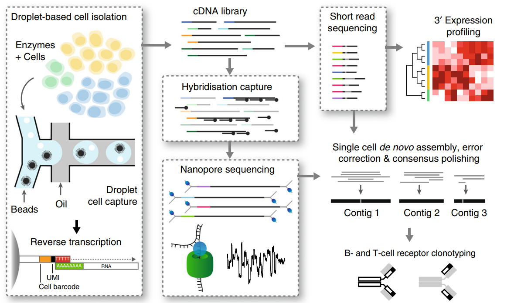
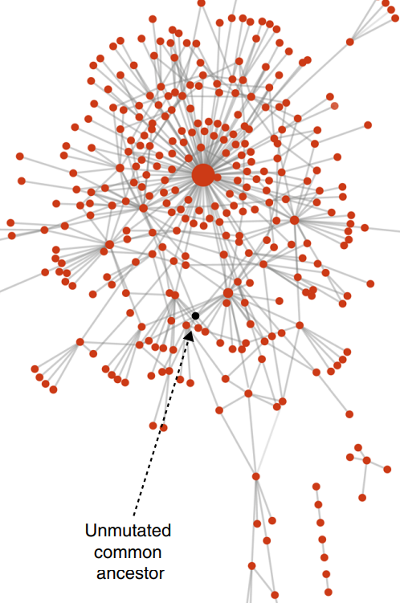
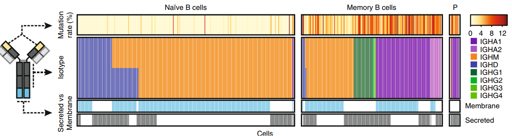

# Long-read-sequencing
## Introduction of third generation Sequencing 
Single molecular seuqncing.
Third generation sequencing(long read sequencing)
### Feature
#### Adventages:
1. The third generation sequencing directly target single molecular without the need for PCR amplification, which avoid extra errors generated during pcr process.
2. Higer speed than next-generation sequencing.
3. Longer read(10k bp). Avoiding assembly error for next generation(50-400 bp)(10.1016/j.cmi.2017.10.013)
#### Disadventages:
1.Accuracy of per read can be much lower than short-read. This is because inability to control the speed of the DNA molecules through the pore.

#### Tools
1. Light signal: SMART microarray, Pacific Biosciences; 
2. Electical signal: Oxford Nanopore Technologies (ONT)

## Smart-Seq2
### Disadvantages
1. It can only processed limited number of cells due to highly relied on plate or well-based microfluidics.10-100s
2. Cost per cell is high as it require amounts of reads to reconstrcuct paired antigen receptors.
3. Short reads makes it difficult or impossible to decipher critical alternative splicing of mRNA segments？？？

## RAGE-seq:targeted long read single cell sequencing(doi:10.1038/s41467-019-11049-4)
Single-cell sequencing only generates short read from one-end of a cDNA template. This short read sequencing can not capture complex gene rearrangement and alternative RNA-splicing.

For example, it can not trace the response of single cell of immune system during their response to cancer. Similarly, gene rearrangement and alternative RNA splicing also create pathological cell divisity amongst cancer cells.

### Nature
Combine full length targeted sequencing by targeted capture and Oxford Nanopore sequencing with short-read profiling at single cell resolution.

### Workflow

1.To cDNA library, short-read sequencing for 3’ expression profiling. 

2.Targeted capture by hybridisation capture and then long-read sequencing.

3.Matching cell barcodes obtained from long-read sequencing with cell barcodes obtained from short-read.

4.De novo assembly long-read sequencing to  full-length TCR or BCR sequences for each cell

### Application
#### B cell clonal network analysis
To some genes in some cell type which have somatic hypermutation per generation, we can identify point mutation by sequencing across the entire specific gene region of mrna. It can identify conserved amino acid mutations and subclones represented by different ratio of cells.

On top of that, genrating clone network based on nearest neighbor distance using the inferred germline sequence as the unmutated ancestor. This network can demonstrate the evolution of individual Ramos cells undergoing active somatic hypermutation

#### Analysis of lymphocytes and lymphocytes across tissues.
Classfication and frequency of sub-cell type of T cells and B cells: Based on  TCRα, TCRβ, TCRγ,  TCRδ chain of TCR in T cells and heavy, light chain of immunoglobulin of B cells as well as levels of specific genes expression.

Alternative splicing analysis.

### Discussion
Reports somatic hypermutation by full-length receptor sequence.

Detecting mRNA isoforms by discovering splice isoforms at single cell level.
 
Capture cell diversity and immunophenotyping by detecting specfic genes expression of cell surface

Identify and integrate biomarkers of responsing to checkpoint inhibitors for TCR clonality, TIL frequency, and gene-expression signatures in single cell level. Identify biomarkers or cell states that predict response to therapy.

#### Limitation
Low recovery of cell barcodes due to the higher error-rate of base-called nanopore sequencing data. 

A large number of PCR cycles can distort the distribution of cell barcodes and UMI sequences.

## ScISOr-Seq(doi:10.1038/nbt.4259)

Without the use of an enrichment strategy, the limited sequencing depth of long-read sequencing platforms results in only highly expressed genes being sampled.

A high cost per cell.
